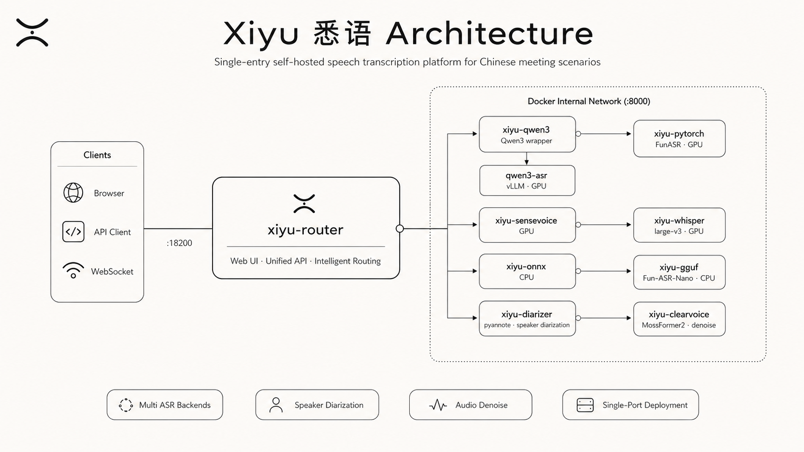

<div align="center">


<p><b>面向中文会议场景的自托管语音转写服务</b><br/>多 ASR 后端 · 说话人分离 · 音频降噪 · 热词纠错 · 可选 LLM 润色，开箱即用、单端口部署。</p>

<p>
  <a href="https://www.python.org/"></a>
  <a href="https://fastapi.tiangolo.com/"></a>
  <a href="https://react.dev/"></a>
  <a href="https://docs.docker.com/compose/"></a>
  <a href="https://tailwindcss.com/"></a>
  <a href="./LICENSE"></a>
</p>

</div>

Xiyu（悉语）把多种主流 ASR 模型、说话人分离、音频降噪、热词与文本后处理、可选的大模型润色，统一收敛到 **单一对外端口 `18200`** 之后。默认部署形态是一套 Docker Compose 栈：对外只暴露一个 Router，其余模型容器都在 Docker 内部网络协作。

**快速导航**：[核心能力](#-核心能力) · [快速开始](#-快速开始) · [架构](#-架构) · [API 速览](#-api-速览) · [技术栈](#-技术栈) · [本地开发](#-本地开发) · [文档](#-文档)

---

## ✨ 核心能力

- **多 ASR 后端**：Qwen3-ASR（默认，远程 vLLM）、FunASR（PyTorch）、SenseVoice、Whisper `large-v3`、ONNX、GGUF（Fun-ASR-Nano），可按需启用、横向对比。
- **智能路由**：内置 Router 根据音频时长自动选择后端（短/长音频阈值可配，默认均走 Qwen3-ASR），对调用方透明。
- **多模型融合对比**：`/api/v1/transcribe/all` 一次请求并行跑多个后端，方便评测与择优。
- **说话人分离**：基于 `pyannote/speaker-diarization-3.1`，自动区分多人对话，可约束人数提升稳定性。
- **音频降噪**：集成 ClearVoice（MossFormer2_48000Hz）降噪微服务，支持长音频分块处理。
- **长音频处理**：分块 + 重叠拼接链路，稳定处理整场会议级别的长录音。
- **热词纠错**：热词 / 上下文热词 / 规则 / 纠正历史，文件改动即时热更新，无需重启。
- **文本后处理**：逆文本规范化（ITN）、全角转半角、政务公文格式化等开箱即用。
- **LLM 润色与会议概览（可选）**：接入大模型做整稿润色、纠错，并按政务口径自动生成会议概览/纪要。
- **完整 Web UI**：React 19 + Tailwind 4 构建的现代界面，支持上传转写、参数配置、结果查看。
- **统一接口**：REST API + WebSocket 实时流式转写 + 自带 OpenAPI 交互文档。
- **可观测性**：内置 `/metrics`（JSON）与 `/metrics/prometheus`（Prometheus）指标。

---

## 🚀 快速开始

### 前置要求

- **NVIDIA GPU**：多数 ASR 后端默认运行在 CUDA 上。单卡也可运行，但需关注显存——可通过 `QWEN3_GPU_MEMORY_UTILIZATION` 等参数下调占用，或把部分后端切换到 CPU。
- **Docker** 与 **Docker Compose**，并安装 **NVIDIA Container Toolkit**（让容器访问 GPU）。
- （可选）国内网络：`.env` 已内置 HuggingFace 镜像（`hf-mirror.com`）与 PyPI 镜像（aliyun），按需配置代理变量。
- （可选）**ClearerVoice-Studio**：启用 ClearVoice 降噪需在宿主机准备其代码目录并挂载，见 `.env.example` 中的 `CLEARVOICE_STUDIO_DIR`。

### 启动

```bash
# 1. 获取代码
git clone https://github.com/skygazer42/TingWu.git
cd TingWu

# 2. 复制示例配置（默认已把对外入口设为 18200）
cp .env.example .env

# 3. 拉起推荐的单入口栈
docker compose up -d --build
```

启动成功后访问：

| 用途 | 地址 |
| --- | --- |
| Web UI | `http://localhost:18200` |
| API 文档（OpenAPI） | `http://localhost:18200/docs` |
| 健康检查 | `http://localhost:18200/health` |

> 部署到服务器时，把 `localhost` 换成服务器 IP 即可——你只需记住并放行 **一个端口**。

### 政务会议一键启动（可选）

如果希望额外触发模型预热、烟测与权重准备：

```bash
./scripts/bootstrap_gov_meeting.sh
```

---

## 🏗️ 架构

推荐部署形态是「单入口 Router + 内部多后端」：对外只发布一个端口（`${PORT:-18200}:8000`），`xiyu-router` 同时承载 Web UI、统一 API 与智能路由；其余模型服务只在 Docker 网络内互通，不对宿主机暴露端口，更安全也更易维护。

<p align="center">
  
</p>

> 内部容器仍监听 `8000`，但那是容器间通信端口，不作为默认对外端口。需要「每个后端独立暴露宿主机端口」的旧形态（A/B 对比、压测、逐后端排障）仍保留在 [Legacy 多模型入口](#-legacy-多模型入口)。

---

## 🔌 API 速览

基础 URL：`http://localhost:18200`，当前版本无需认证。

| 方法 | 端点 | 说明 |
| --- | --- | --- |
| `GET` | `/health` | 健康检查 |
| `POST` | `/api/v1/transcribe` | 同步转写（单文件） |
| `POST` | `/api/v1/transcribe/all` | 多后端同时转写，便于对比 / 融合 |
| `POST` | `/api/v1/transcribe/batch` | 批量转写 |
| `POST` | `/api/v1/trans/file` · `/trans/url` · `/trans/video` | 异步转写（文件 / URL / 视频），配合结果查询接口 |
| `WS` | WebSocket | 实时流式转写，见 `examples/client_websocket.py` |
| `GET` | `/metrics` · `/metrics/prometheus` | 服务指标 |
| `GET` | `/docs` | OpenAPI 交互式文档 |

此外还提供热词管理、配置管理等接口，完整列表与字段说明见 [`docs/API.md`](./docs/API.md)。

发一条转写请求：

```bash
curl -X POST "http://localhost:18200/api/v1/transcribe" \
  -F "file=@meeting.wav"
```

仓库还提供了可直接运行的客户端示例：

```bash
python examples/client_http.py        # HTTP 同步 / 异步转写示例
python examples/client_websocket.py   # WebSocket 实时转写示例
```

---

## 🧩 技术栈

| 层 | 主要技术 |
| --- | --- |
| 后端 | Python 3.10+ · FastAPI · Uvicorn · Pydantic v2 |
| 推理 | PyTorch · FunASR · faster-whisper · ModelScope · vLLM（Qwen3） |
| 模型 | Qwen3-ASR-1.7B · SenseVoiceSmall · Whisper large-v3 · Fun-ASR-Nano(GGUF) · pyannote 3.1 · ClearVoice MossFormer2 |
| 前端 | React 19 · Vite · TypeScript · Radix UI · Tailwind CSS 4 · Zustand · TanStack Query |
| 部署 | Docker · Docker Compose · NVIDIA Container Toolkit |

---

## 🛠️ 本地开发

### 后端

```bash
python3 -m venv .venv
source .venv/bin/activate
pip install -r requirements.txt

PORT=18200 python3 -m src.main
```

### 前端

```bash
cd frontend
npm install
npm run dev
```

前端 Vite 开发代理默认转发到 `http://localhost:18200`。

### 常用命令

```bash
docker compose ps                              # 查看栈状态
docker compose logs -f                         # 跟踪日志
curl -sS http://localhost:18200/health         # 健康检查
```

---

## 📚 文档

完整文档位于 [`docs/`](./docs)，按角色检索：

| 角色 | 推荐文档 |
| --- | --- |
| 业务用户 | [`WEB_UI.md`](./docs/WEB_UI.md) |
| 部署 / 运维 | [`DEPLOYMENT.md`](./docs/DEPLOYMENT.md) · [`TROUBLESHOOTING.md`](./docs/TROUBLESHOOTING.md) |
| 前端实施 / 联调 | [`WEB_UI_IMPLEMENTATION.md`](./docs/WEB_UI_IMPLEMENTATION.md) · [`WEB_UI_FRONTEND_TROUBLESHOOTING.md`](./docs/WEB_UI_FRONTEND_TROUBLESHOOTING.md) · [`WEB_UI_TECHNICAL.md`](./docs/WEB_UI_TECHNICAL.md) |
| 后端实施 / 联调 | [`BACKEND_IMPLEMENTATION.md`](./docs/BACKEND_IMPLEMENTATION.md) · [`BACKEND_TROUBLESHOOTING.md`](./docs/BACKEND_TROUBLESHOOTING.md) · [`BACKEND_TECHNICAL.md`](./docs/BACKEND_TECHNICAL.md) |
| API 集成 | [`API.md`](./docs/API.md) |
| 多模型 / 性能对比 | [`MODELS.md`](./docs/MODELS.md) |

---

## 🗂️ 目录结构

```text
.
├── src/              # FastAPI 服务与转写逻辑（api / core / services / models / utils）
├── frontend/         # React + Vite Web UI
├── scripts/          # 启动、预热、烟测、基准与辅助脚本
├── examples/         # HTTP / WebSocket 客户端示例
├── docker/           # Dockerfile 相关与 docker/compose/legacy
├── docs/             # 项目文档（docs/legacy 保留迁移前长版参考）
├── configs/          # 配置文件
└── docker-compose.yml  # 推荐的单入口部署栈
```

---

## 🧱 Legacy 多模型入口

仓库保留了旧的「每个后端一个宿主机端口」的 Compose 文件，位于 `docker/compose/legacy/`，主要用于 A/B 对比、性能压测、逐后端排障或单独暴露特定模型。用法与文件清单见 [`docs/MODELS.md`](./docs/MODELS.md)。

---

## 🤝 贡献

欢迎通过 Issue 反馈问题、提交 Pull Request 改进项目。提交前请确保相关测试通过（见 `tests/` 与 `pytest.ini`）。

---

## 📄 License

本项目基于 [MIT License](./LICENSE) 开源。
